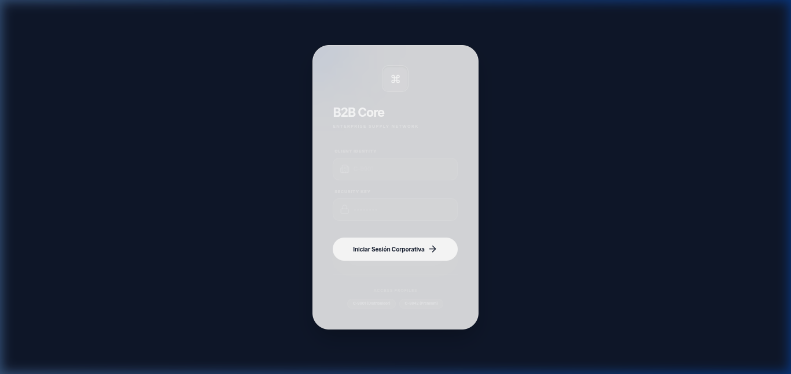
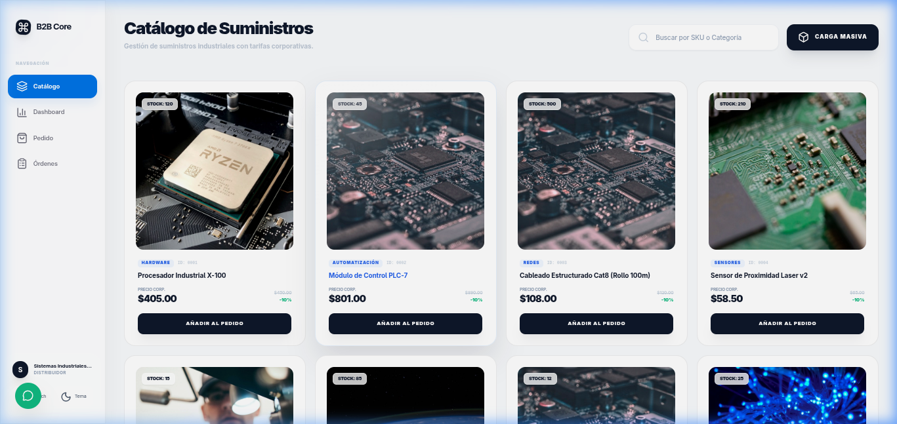
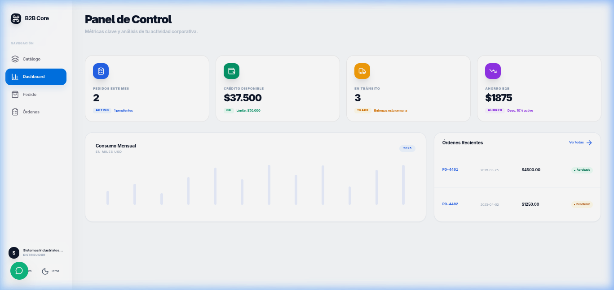
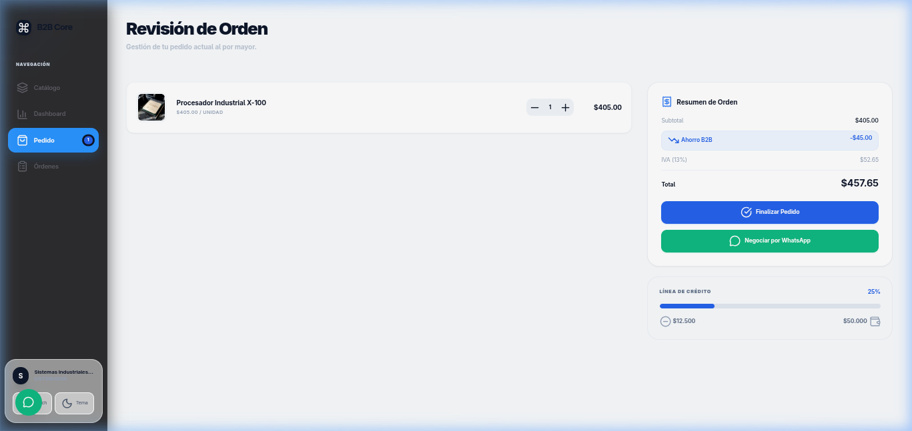

# 🏭 B2B Core | Industrial E-commerce Platform

[]()
[]()
[]()
[]()

Una plataforma de E-commerce B2B (Business-to-Business) de alto rendimiento, diseñada para la gestión de suministros industriales con lógica de precios dinámica, gestión de crédito corporativo y una interfaz premium estilo Apple.

---

## 🖥️ Vista Previa del Proyecto

<div align="center">
  <table style="width: 100%; border-collapse: collapse;">
    <tr>
      <td align="center" width="50%">
        <b>Pantalla de Login Glassmorphic</b><br>
        
      </td>
      <td align="center" width="50%">
        <b>Catálogo de Suministros (Modo Oscuro)</b><br>
        
      </td>
    </tr>
    <tr>
      <td align="center" width="50%">
        <b>Dashboard Corporativo</b><br>
        
      </td>
      <td align="center" width="50%">
        <b>Resumen del Pedido (Carrito)</b><br>
        
      </td>
    </tr>
  </table>
</div>

---

## 🧠 Arquitectura: ¿SPA o HTML Partials?

Este proyecto implementa una **SPA (Single Page Application)** construida con **Vanilla JavaScript puro**, sin frameworks externos.

### ¿Qué es una SPA?

Una **Single Page Application** es una aplicación web donde el navegador **carga un único archivo HTML** (`index.html`) y **nunca recarga la página**. Todas las "pantallas" (catálogo, carrito, dashboard, login) se renderizan dinámicamente mediante JavaScript.

```
Usuario hace clic → JavaScript intercepta → Renderiza nueva vista → URL puede cambiar
                   (NO recarga el browser)
```

### ¿Qué son los HTML Partials?

Los **HTML Partials** son un enfoque alternativo donde cada "sección" de la UI (navbar, footer, sidebar, tarjeta de producto) se guarda como un **fragmento HTML independiente** y se inyecta en la página principal vía `fetch()`.

```javascript
// Ejemplo de HTML Partial
const html = await fetch('/components/navbar.html').then(r => r.text());
document.getElementById('navbar-slot').innerHTML = html;
```

### ¿Cuál usa este proyecto?

| Característica          | SPA (este proyecto ✅) | HTML Partials         |
|------------------------|------------------------|-----------------------|
| Archivos HTML          | Solo `index.html`      | Uno por componente    |
| Navegación             | JavaScript puro        | `fetch()` + slot      |
| Servidor necesario     | No (abre directo)      | Sí (requiere servidor)|
| Velocidad de cambio    | Instantánea            | Puede parpadear       |
| Complejidad inicial    | Media                  | Baja                  |
| Escala a proyectos grandes | Con router JS     | Con SSR o frameworks  |

> En este proyecto, **todas las vistas viven dentro de `index.html`** como `<div>` ocultos que se muestran/ocultan con JavaScript según la ruta activa.

---

## 📁 Estructura del Proyecto

La estructura de carpetas sigue el patrón recomendado para una **SPA escalable con Vanilla JS**:

```
/mi-ecommerce-b2b
│
├── /assets                     ← Archivos estáticos globales
│   ├── /css
│   │   ├── variables.css       ← Tokens de diseño: colores, fuentes, radios
│   │   └── global.css          ← Estilos base y componentes reutilizables
│   ├── /img                    ← Logos, imágenes de productos, mockups
│   └── /js
│       ├── app.js              ← Lógica principal: estado, render, acciones
│       └── router.js           ← Cambia de "página" sin recargar el browser
│
├── /components                 ← Fragmentos de UI que se repiten (Partials)
│   ├── navbar.html             ← Menú de navegación superior
│   ├── footer.html             ← Pie de página
│   ├── sidebar.html            ← Menú lateral de filtros/categorías
│   └── product-card.html       ← Tarjeta individual de un producto
│
├── /pages                      ← Contenido único de cada "pantalla"
│   ├── login.html              ← Vista de autenticación
│   ├── catalogo.html           ← Catálogo de productos B2B
│   ├── carrito-b2b.html        ← Gestión de órdenes al por mayor
│   └── dashboard.html          ← Panel de control del cliente
│
└── index.html                  ← El ÚNICO archivo que el browser carga directamente
```

---

## 🔄 ¿Cómo funciona el Router?

El `router.js` es el **cerebro de la navegación**. Escucha los clics en los botones de navegación y decide qué vista renderizar:

```javascript
// router.js — Lógica simplificada
const routes = {
  'catalog'    : renderCatalog,
  'cart'       : renderCart,
  'dashboard'  : renderDashboard,
  'orders-full': renderOrdersFull,
};

function navigate(view) {
  state.view = view;      // 1. Actualiza el estado global
  render();               // 2. Dispara el re-renderizado
}
```

Cada vez que se llama a `navigate('dashboard')`:
1. Se **ocultan todas las vistas** (`div.view-container → hidden`)
2. Se **muestra solo la activa** (`div#view-dashboard → visible`)
3. Se **llama a su función de renderizado** para inyectar el HTML dinámico

---

## 🗂️ Responsabilidad de cada archivo

| Archivo              | Responsabilidad                                                    |
|---------------------|--------------------------------------------------------------------|
| `index.html`        | Estructura base: shell, sidebar, modales, slots de vistas          |
| `assets/js/app.js`  | Estado global, funciones de render, acciones (addToCart, checkout) |
| `assets/css/styles.css` | Variables CSS, animaciones, glassmorphism, dark mode           |
| `/pages/*.html`     | (Escalabilidad futura) Contenido modular por vista                 |
| `/components/*.html`| (Escalabilidad futura) Fragmentos reutilizables cargados por fetch |

---

## 🚀 Características Principales

### 💎 Experiencia de Usuario (UX)
- **Interfaz Premium:** Diseño estilo Apple con Glassmorphism y animaciones fluidas.
- **Modo Oscuro/Claro:** Selector de tema persistente via `localStorage`.
- **SPA Real:** Navegación instantánea entre todas las pantallas sin recarga.
- **Toast Notifications:** Sistema de alertas con animación de entrada/salida.
- **Cursor y Scroll Progress:** Indicadores visuales premium.

### 💼 Lógica de Negocio B2B
- **Precios por Volumen (Tiers):** Descuentos automáticos según cantidad pedida.
- **Perfiles de Cliente:** Distribuidor (10%) y Partner Premium (20%).
- **Gestión de Crédito Corporativo:** Barra de uso, alertas de límite.
- **Validación de Stock:** Control proactivo en tiempo real.
- **Carga Masiva (Bulk Import):** Importa SKUs y cantidades desde texto plano.

### 📊 Dashboard Estratégico
- **Bento Grid de KPIs:** 4 tarjetas con estadísticas clave animadas.
- **Gráfico de Consumo Mensual:** Barras interactivas con tooltip.
- **Historial de Órdenes:** Filtros por estado (Todos / Pendientes / Aprobados).
- **Rastreo Visual de Envíos:** Timeline de 5 pasos con estado en tiempo real.
- **Factura Imprimible:** Modal con vista de impresión optimizada.

---

## 🛠️ Stack Tecnológico

| Capa         | Tecnología                              | Versión  |
|-------------|------------------------------------------|----------|
| Estructura  | HTML5 Semántico                          | —        |
| Estilos     | CSS3 + Tailwind CSS (CDN) + CSS Custom   | v3       |
| Lógica      | JavaScript ES6+ (Vanilla, sin framework) | ES2022   |
| Persistencia| `localStorage` (estado del carrito/tema) | Web API  |
| Iconografía | Lucide Icons                             | Latest   |
| Fuentes     | Inter (Google Fonts)                     | —        |

---

## 📖 Instalación y Uso

Este proyecto es **100% Vanilla** — no requiere Node.js, npm, ni ninguna compilación.

```bash
# 1. Clona el repositorio
git clone https://github.com/ByChokeYT/b2b-core.git

# 2. Entra al directorio
cd b2b-core

# 3. Abre directamente en el navegador (no necesita servidor)
open index.html
# o simplemente arrastra el archivo al navegador
```

> ⚠️ Si en el futuro se migra a **HTML Partials** con `fetch()`, se necesitará un servidor local (ej: `npx serve .` o la extensión Live Server de VS Code) porque los navegadores bloquean `fetch()` sobre `file://` por CORS.

---

## 📝 Nota Técnica — Estado Centralizado

La plataforma usa un **objeto `state` global** como fuente única de verdad, similar al patrón Redux pero en Vanilla JS:

```javascript
let state = {
  user: CUSTOMER_PROFILES.distributor,  // Perfil activo
  view: 'catalog',                       // Vista actual
  cart: [],                              // Items en carrito
  orders: [...],                         // Historial de órdenes
  theme: 'light',                        // Tema activo
  isLoggedIn: false                      // Sesión
};
```

Cualquier cambio en `state` dispara `render()`, que actualiza toda la UI de manera reactiva.

---

Desarrollado con ❤️ por **José Luis Choquevillca** para el sector industrial B2B.